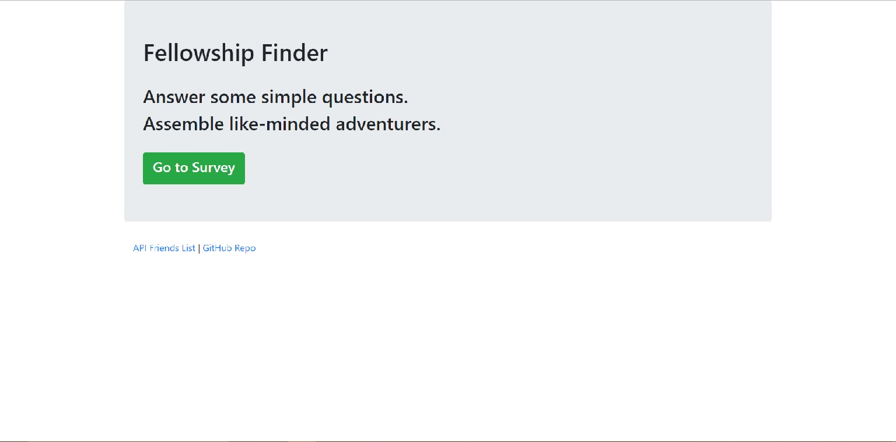
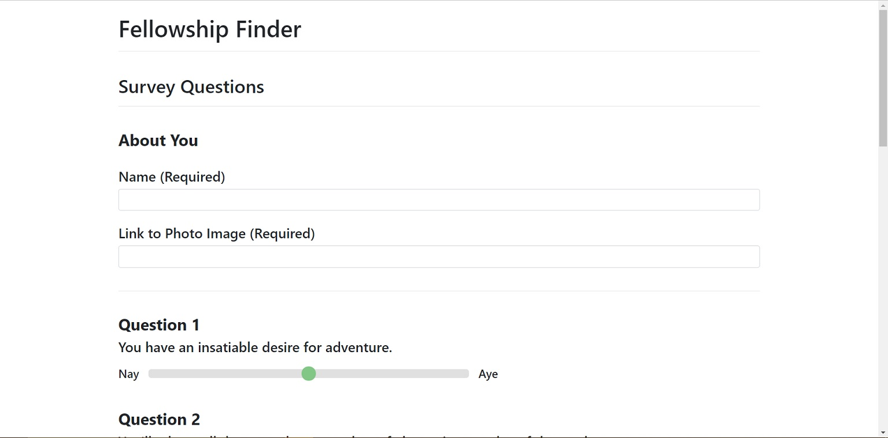
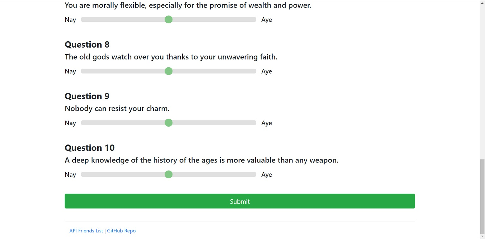
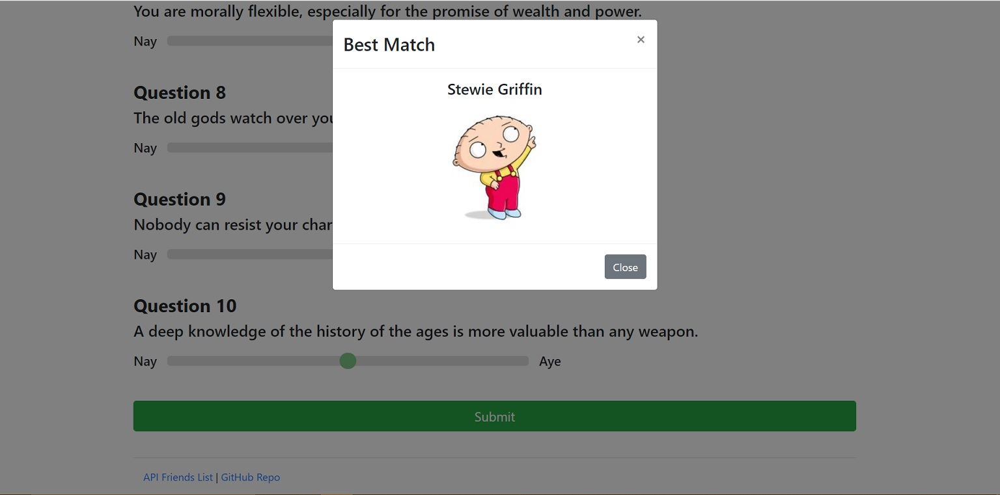
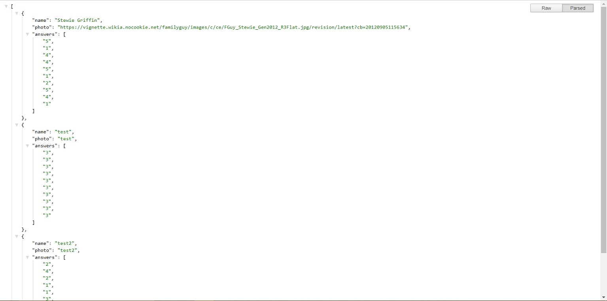

# fellowship-finder

## Description

A simple app to find others with similar personalities that was developed to practice and demonstrate my skills with an emphasis on node.js and Express.js.

## Walkthrough

Starting on the home page, click the 'Go to Survey' button to proceed to the survey.

Fill out the survey as directed, then click 'Submit'.

You will be matched with another user that has the most similar answers to your own.

Click 'API Friends List' at the bottom of the page to view all users data as an array of JSON objects.

## Contribution and Help

Morrowii is the sole person maintaining and contributing to this project.

If you need help with anything related to this project, drop me a line on GitHub.